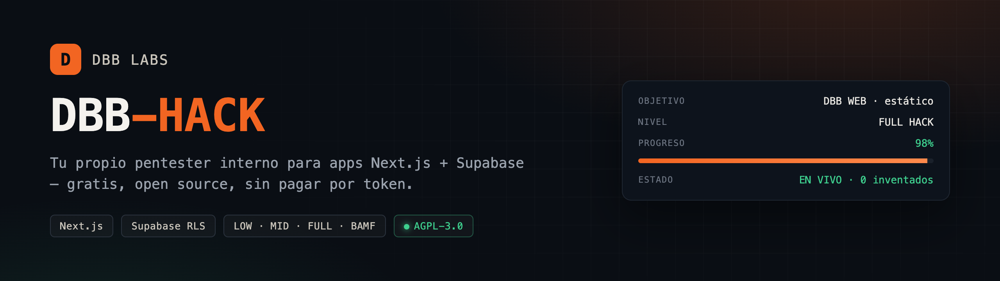
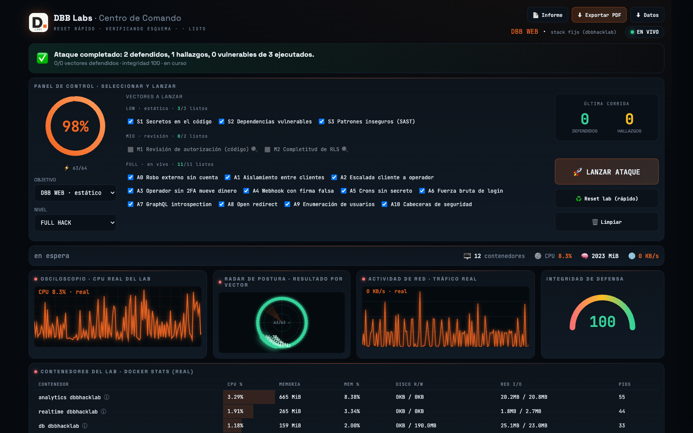
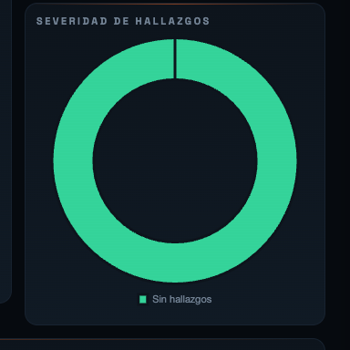
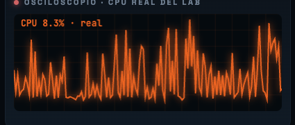
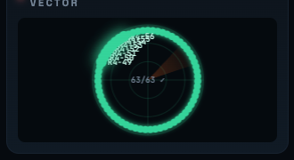
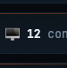
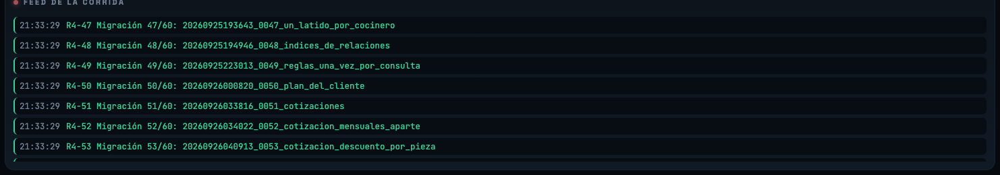

# DBB-HACK

**Your own in-house pentester for Next.js + Supabase apps — free, open source, no token billing.**
Built after burning real money on a paid AI-pentest tool that died mid-run on provider limits.


*English · [Leer en español](README.es.md)*

> © 2026 Felipe Córdova · DBB Labs — Licence **GNU AGPL-3.0** (see `LICENSE`) + Chilean legal
> scopes. Offensive tool: use only on systems you own or are authorized, in writing, to test.

## 🍺 BUY ME A BEER
### If this saved you money on a pentest, buy me a beer
# 👉 **[buymeacoffee.com/DbbLabs](https://buymeacoffee.com/DbbLabs)** 👈

| 14 vectors | 4 levels | 0 fabricated results |
|---|---|---|
| static + live exploitation | LOW → BAMF | "not tested" instead of a fake finding |

---

DBB-HACK is an in-house pentester for **Next.js + Supabase** apps, with its own
**command-center console (DBB Labs)**. Runs on Claude Code / local tooling — no
per-token billing. Playbooks adapted from Strix (Apache-2.0, see `NOTICE`), mapped to
ISO 27002 / OWASP. Licence: **GNU AGPL-3.0** (see `LICENSE`), with Chilean legal scopes
attached.

| | |
|---|---|
| [What it does](#what-it-does-today) | static analysis + live exploitation + live console |
| [4 levels](#4-levels) | LOW, MID, FULL, BAMF — what each one attacks |
| [Run it locally](#run-it-locally) | Docker + one command |
| [Integrity guarantee](#integrity-guarantee-golden-rule) | why it never fakes a result |
| [Generic scope](#generic-scope) | what runs on any project vs. what needs seeded accounts |
| [Honest limits](#honest-limits) | what this is not |
| [Tests](#tests) | the console's own test suite |

## Architecture


## What it does (today)
- **Static analysis** of the code: secrets (gitleaks), dependencies (npm audit), SAST (semgrep).
- **LIVE exploitation** in an **isolated local lab**: mounts the project's Supabase + app
  and launches real attacks (external data theft, IDOR/RLS, privilege escalation, 2FA,
  webhook, crons, brute force, GraphQL, open redirect, enumeration, headers).
- **Live console** (http://localhost:8899): control panel, progress pie, feed, attack
  matrix, posture radar, container table (real `docker stats`), embedded report + PDF
  export, and a per-vector panel with a remediation recommendation + ready-to-use prompt.

## 4 levels

| Level | Does |
|---|---|
| **LOW** | Static only: secrets, dependencies, SAST |
| **MID** | + human review of playbooks, still never touches the running app |
| **FULL** | + live attacks in an isolated local lab |
| **BAMF** | + ASVS/WSTG, money flows, compliance mapping |

See `niveles.md` and the catalog `dashboard/vectores.json`.

## Run it locally

### Requirements

- **[Docker](https://www.docker.com/)**, installed and running. **Required** — FULL/BAMF
  exploitation doesn't run against your real database, it runs against a **throwaway copy
  of your Supabase + app stack inside Docker containers**, on your own machine. Nothing
  ever touches production. If Docker isn't running, FULL/BAMF vectors report
  **"not tested"** instead of faking a result — LOW/MID (static analysis) work without it.
- **[Claude Code](https://claude.com/claude-code)** — free, runs locally, which is why
  DBB-HACK doesn't bill per token.

### What Docker actually does here

`montar-lab.sh` reads the target project's own `docker-compose`/Supabase config and spins
up an **isolated clone**: its own Postgres, Supabase Auth/Storage/Realtime, and the app
itself, all in containers with their own network — never your project's live database or
deployed app. That's the "lab". The console's container table shows real
`docker stats`/`docker logs` from these containers while an attack runs, and
`dashboard/reset-lab.sh` tears the clone down and rebuilds it clean between runs.

### Start it

```bash
git clone https://github.com/DBB-Labs/dbb-hack.git
cd dbb-hack
docker --version          # confirm Docker is installed and running
bash dashboard/servir.sh  # opens the console at http://localhost:8899
```

Pick a target (any repo in `~/Documents/Proyectos`) + level + vectors, and launch. In
FULL/BAMF, the auto-mounter (`montar-lab.sh`) brings up that project's isolated lab on
its own — you don't run `docker compose` by hand. Reports are saved to
`~/Documents/STRIX ANALISIS/<year>/<project>/<month>/`.

### The console



<details>
<summary><b>Individual panels</b> (control panel, oscilloscope, posture radar, Docker containers, activity feed)</summary>
<br>

| | |
|---|---|
|  **Control panel** — target, level, vector checklist, launch |  **Oscilloscope** — real lab CPU while the attack runs |
|  **Posture radar** — per-vector result at a glance |  **Docker containers** — real `docker stats`, never mocked |
|  **Activity feed** — live log of every step the attack takes | |

</details>

## Integrity guarantee (golden rule)

**It never fabricates a result.** If the target lab isn't mounted (the `project_id`
doesn't match) or the app doesn't respond, live vectors stay **"not tested"** — never a
fake vulnerable/finding. Only the target's own lab is attacked, never production.

## Generic scope

External/static vectors (S1-S3, A0, A7, A8, A9, A10) run on **any** Supabase+Next
project. Schema-specific vectors (A1/A2/A3: RLS, escalation, 2FA) need accounts seeded
with the project's schema; without them → "not tested".

## Honest limits

DBB-HACK **does** do live exploitation (in an isolated lab). What it is **not**: an
**accredited external pentest** — its coverage is limited to the vectors it implements,
it doesn't have a human red team's creativity, it runs in a local lab, and it doesn't
replace the independent audit a regulator (e.g. CMF) requires. It's a strong, continuous,
free layer — not the final compliance seal.

## Tests

`npm run test:e2e` — Playwright suite for the console's flow.
